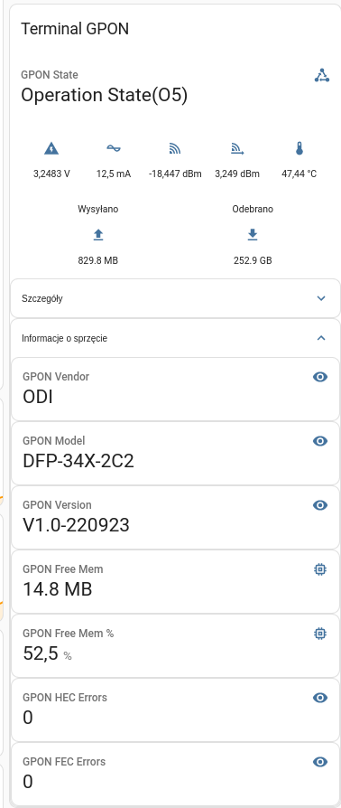

# Integrating RTL8672/RTL960x DFP-34X-2C2 GPON SFP Stick with Home Assistant

## Screenshot



## Some Theory

I wanted to integrate my GPON SFP terminal with Home Assistant to be able to get some statistics
about my fiber connection.
Looked into firmware, but cant find any way to get all data which are presented in web config.
Also, web config is very simple and old, it doesn't use any AJAX or REST API. Web server is just
replacing in-place tokens with generated HTML code.
On first glance, it is supposed that no other way than parsing HTML can be used to get data.
But there is some other, more tricky technique.

My terminal has a lot of unused web pages in /home/httpd/web, such as for ex. WiFi setup pages.
And also, FW contains bindfs module and writeable JFFS2 partition (/var/config). So it is possible to create a JSON template (See @status.json) with parseable tokens (like normal web config page), push it into /var/config and bind it with some unused web page file.
Then, web config server should serve our template instead of already included unused web config page.
And it worked ;) And automated in @gpon_mqtt.sh.

## Installation

First of all, install sshpass - it's needed by bash script to pass SSH password to terminal during SSH autentication. Also, script transmits grabbed data to Home Assistant via MQTT, so MQTT server must be
configured.
If you met those prerequisites, adjust variables in @gpon_mqtt.sh, and add it to cron to be executed every minute.

Now before first start, you need to pass status.json somehow to terminal to config partition.
There are two options:
 - Start a TFTP Server, and then use TFTP to copy status.json to /var/config.
 - More complicated way, using uploadlogo.asp bug.

   There is a secret web page named uploadlogo.asp. Normally, it is used for customization of login and top bar logo. Also, this web page doesn't have file type check :)
   So just open http://<Your terminal IP>/uploadlogo.asp and pass status.json. Web server will save file on fs in /var/config/topbar.gif. Then just log-into device, and copy from /var/config/topbar.gif into /var/config/status.json"

   ```
   cp /var/config/topbar.gif /var/config/status.json
   ```

   After that, open uploadlogo.asp again and upload real PNG or GIF file.

## Home Assistant Configuration

There is an already prepared file gpon_mqtt_sensros.yaml. Place its content under mqtt sensors section, and that's it!

## Caevats

SSH Server is very, very slow - unsure why but even if CPU load is 0%, connecting to it takes sometimes few seconds.

Also, if you have an problem with connecting to it, add this to your ~/.ssh/config:
```
Host YourTerminalIp
     User admin
     PubkeyAcceptedAlgorithms +ssh-rsa
     HostkeyAlgorithms +ssh-rsa
     KexAlgorithms +diffie-hellman-group1-sha1
     Ciphers +3des-cbc
```
This is needed because SSH server is using only very legacy settings which are prohibited in recent clients.
Script already has this option added inline.

